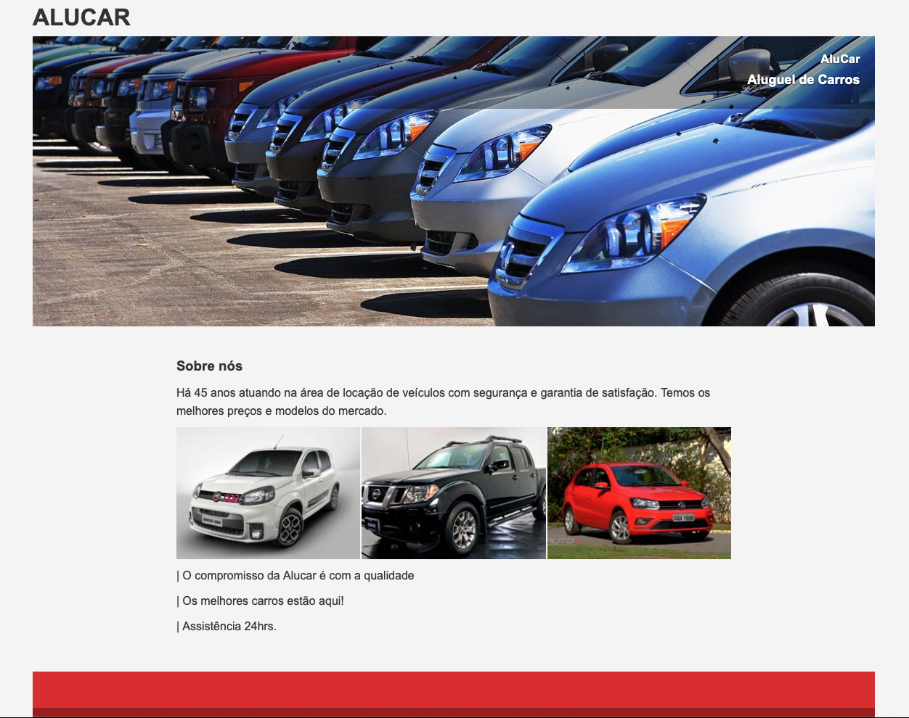

# AluCar — Aluguel de Veículos

Site institucional estático para a locadora de veículos AluCar. O projeto utiliza apenas HTML5 e CSS3 (sem dependências) e entrega uma landing page simples com seções de destaque, sobre, contato e um formulário para análise de cadastro.

## Demo
- URL (quando o GitHub Pages estiver habilitado): https://flawiin.github.io/alucar/
- Pré-visualização local: abra `index.html` diretamente no navegador.

## Funcionalidades
- Hero com imagem de capa e overlay com título e subtítulo.
- Seções: Sobre nós, Contato e Formulário de Análise de Cadastro.
- Formulário com campos: Nome, Data de Nascimento, Telefone, CNH (Registro e Validade) e seleção de Modelo do Carro.
- Acessibilidade básica: uso de `label`, `fieldset`/`legend` e `alt` descritivo em imagens.
- SEO essencial: `meta description`, `author` e `robots` definidos em `index.html`.
- Layout fluido com imagens responsivas e tipografia padrão do sistema.
- Sem JavaScript ou bibliotecas externas — fácil de manter e publicar.

## Estrutura do Projeto
- `index.html` — página principal com a marcação das seções (hero, about, contact, form, footer).
- `assets/css/style.css` — estilos da página (BEM-like e classes por seção).
- `assets/img/` — imagens utilizadas (capa e galeria).
- `assets/doc/TEXTOS DA PAGINA.txt` — rascunho de textos de conteúdo.

## Como Executar Localmente
Opção 1 — Abrir direto:
- Dê duplo clique em `index.html` ou arraste para o navegador.

Opção 2 — Servidor local (recomendado):
- Python 3: `python3 -m http.server 8000` e acesse `http://localhost:8000`.
- Node (npx serve): `npx serve .` e acesse a URL indicada.

## Como Publicar no GitHub Pages
1) No GitHub, vá em Settings → Pages.
2) Em Build and deployment, escolha Source: `Deploy from a branch`.
3) Selecione `main` e `/ (root)` e clique em Save.
4) Acesse a URL indicada (ex.: `https://<seu-usuario>.github.io/alucar/`).

## Personalização Rápida
- Conteúdo: edite textos e estrutura em `index.html`.
- Estilos: ajuste classes em `assets/css/style.css` (blocos: `.hero`, `.about`, `.contact`, `.form-section`, `.footer`).
- Imagens: substitua arquivos em `assets/img/` mantendo os nomes ou atualize os `src` no HTML.

## Boas Práticas Implementadas
- Marcação semântica e separação de responsabilidades (HTML/CSS).
- Classes descritivas e consistentes por seção.
- Acessibilidade e SEO básicos desde o início.

## Roadmap (Ideias Futuras)
- Validação de formulário no front-end e mensagens de sucesso/erro.
- Integração com backend para envio real dos dados.
- Analytics e melhoria de SEO (Open Graph/Twitter Cards).
- Favicon e manifesto para PWA leve (opcional).

## Autor
- Flávio Pimentel

## Licença
Nenhuma licença especificada no repositório.
